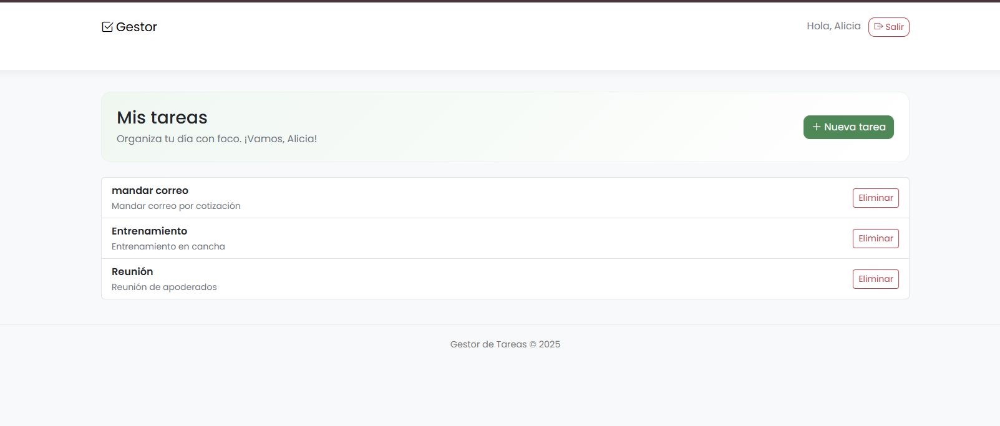
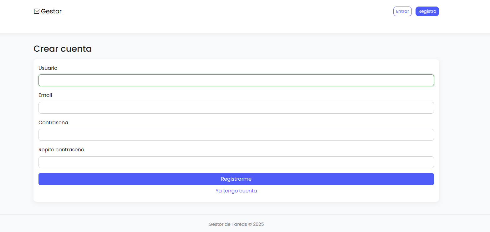
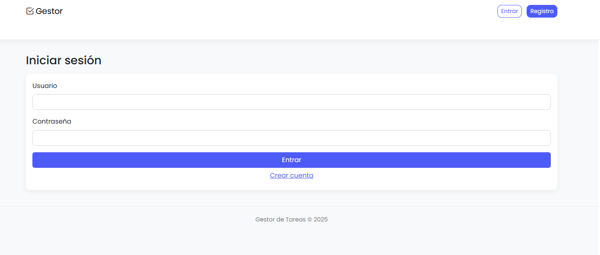
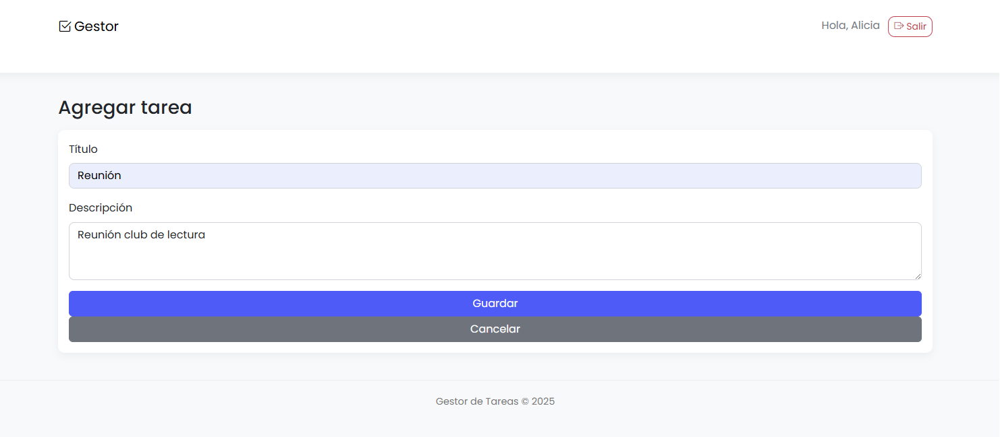
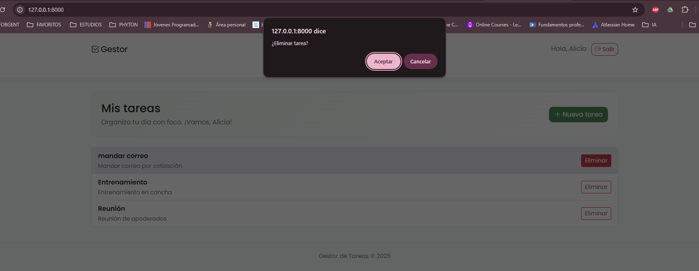

# Gestor de Tareas (Django sin base de datos)

Aplicación web para gestionar tareas personales con autenticación de usuarios.  
Las tareas se almacenan **en memoria**, por lo que se reinician al detener el servidor.  
Desarrollada como ejercicio del módulo Django del Bootcamp.

---

## Funcionalidades principales

✅ Registro, inicio y cierre de sesión de usuarios.  
✅ Crear, ver, y eliminar tareas (CRUD en memoria).  
✅ Vistas protegidas con `@login_required`.  
✅ Interfaz basada en **Bootstrap 5** y estilos personalizados.  

---

## Tecnologías utilizadas

- Python 3.12  
- Django 5.2  
- Bootstrap 5  
- HTML + CSS  

---

## Instalación y ejecución

```bash
# 1️ Crear entorno virtual
python -m venv env
env\Scripts\activate

# 2️ Instalar Django
pip install django

# 3️ Migrar base de datos (solo para usuarios)
python manage.py migrate

# 4️ Ejecutar servidor
python manage.py runserver
```
Abre en tu navegador 👉 http://127.0.0.1:8000/

## Estructura del proyecto
```bash
gestor_tareas/
├─ gestor_tareas/
│  ├─ settings.py
│  ├─ urls.py
│  └─ ...
├─ tareas/
│  ├─ views.py
│  ├─ urls.py
│  ├─ forms.py
│  └─ ...
├─ templates/
│  ├─ base.html
│  ├─ auth/
│  │  ├─ login.html
│  │  └─ register.html
│  └─ tareas/
│     ├─ lista.html
│     ├─ agregar.html
│     ├─ detalle.html
│     └─ eliminar.html
├─ static/
│  └─ css/
│     └─ styles.css
├─ img/
│  ├─ Pagina_principal.png
│  ├─ login.png
│  ├─ formulario_registro.png
│  ├─ agregar_tarea.png
│  └─ eliminar_tarea.png
└─ manage.py

```
## Capturas de pantalla












## Rutas principales
URL	Nombre	Descripción
/	tareas_lista	Lista de tareas del usuario
/tarea/<int:tid>/	tareas_detalle	Detalle de tarea
/agregar/	tareas_agregar	Agregar nueva tarea
/eliminar/<int:tid>/	tareas_eliminar	Eliminar tarea existente
/login/	login	Iniciar sesión
/register/	register	Crear cuenta
/logout/	logout	Cerrar sesión

## Configuración clave (settings.py)
```bash
LOGIN_URL = "login"
LOGIN_REDIRECT_URL = "tareas_lista"
LOGOUT_REDIRECT_URL = "login"

STATIC_URL = "static/"
STATICFILES_DIRS = [BASE_DIR / "static"]
TEMPLATES[0]["DIRS"] = [BASE_DIR / "templates"]
```
## Pruebas básicas
 Acceso no autenticado redirige a /login/.
 Crear usuario y acceder con sus credenciales.
 Agregar una tarea y verla en la lista.
 Eliminar tarea correctamente.
 Listas independientes por usuario.

## Autoría
Desarrollado por Catalina Villegas Ortega
Proyecto de práctica — Bootcamp Talento Digital 
